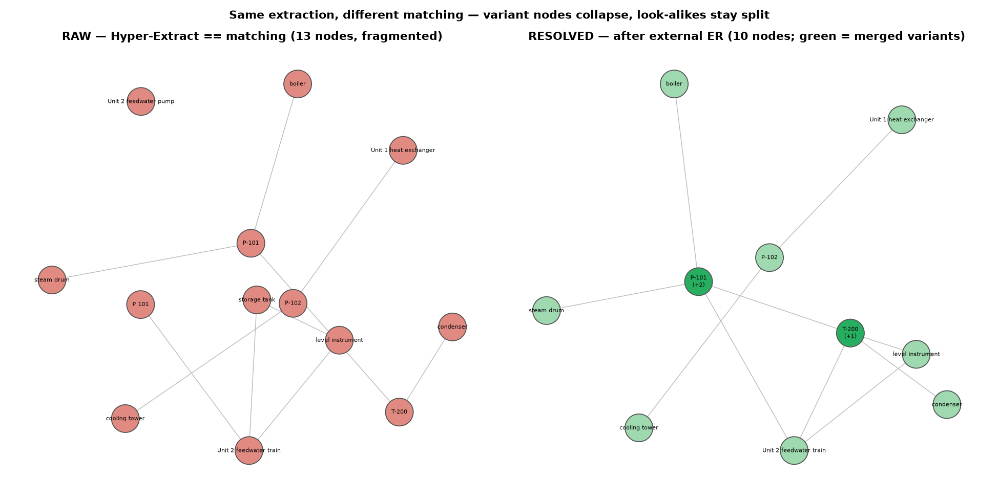
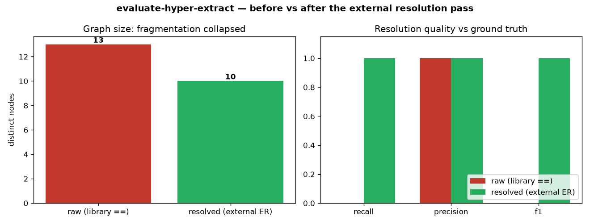
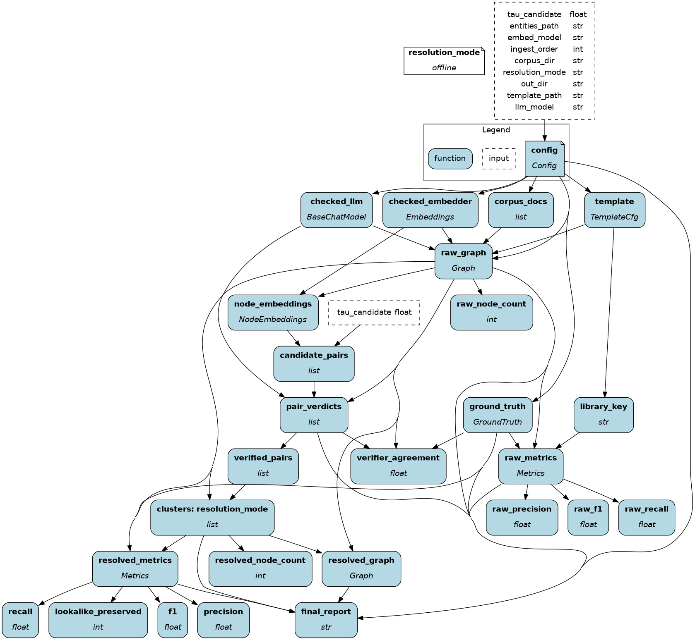

# evaluate-hyper-extract — what this is and how to look at it

A visual, plain-language tour of what was built and why. For the full design see
[design.md](design.md)

## The goal (not "extract a knowledge graph")

The goal was to **analyze and try to fix the one defect that silently decides graph quality**.
Hyper-Extract / ontomem does extraction and field-fusion with an LLM, but it does
**matching** — deciding which mentions are the *same* entity — with a string-equality
`==` on the entity key (`ontomem...BaseMerger._group_by_key`, a `defaultdict[key]`).
That `==` **fragments** variant-named entities (`P-101` / `P 101` / `the feedwater
pump` → many nodes) and **over-merges** look-alikes (`P-101` in two units → one node).

So this repo is a **harness** that:

1. **Measures** the fragmentation the library produces,
2. **Repairs** it with a proper external entity-resolution pass
   (embed → candidate → LLM-verify → cluster), and
3. **Evaluates** the before/after against a ground-truth manifest,

…all as a **gated Apache Hamilton dataflow** with **local, venv-only MLflow**
observability. Nothing here trusts the `==`; the whole point is to show what it costs
and undo it.

## Raw vs resolved — same extraction, different *matching*

This is the crux, and it's easy to misread. **Both graphs come from the same
Hyper-Extract extraction** — the LLM reading the documents into entity objects works
fine and is shared. What differs is how mentions are **matched into entities**:

- **Raw graph** = Hyper-Extract's *own* matching: a string `==` on the name. So
  `P-101`, `P 101`, and `Unit 2 feedwater pump` stay **three separate nodes** — the
  library **misses** that they are one physical pump. This is the defect under study.
- **Resolved graph** = we take *those same nodes* and re-match them with a real
  entity-resolution pass (embed → LLM-verify → cluster). It recognizes the three are
  one asset and **collapses them into a single node**.

The resolved pass does **not** re-run Hyper-Extract; it repairs Hyper-Extract's
matching. Concretely, from one run:

```
RAW  (Hyper-Extract ==):  'P 101' , 'P-101' , 'Unit 2 feedwater pump'   →  3 nodes
RESOLVED (external ER):   'P-101'  ⟵ merged: 'P 101', 'Unit 2 feedwater pump'   →  1 node
```

So if you look at the resolved graph and **don't see `P 101`, that's the point** — it
was absorbed into the `P-101` node. Each resolved node records the surface forms it
swallowed in its `aliases` field (shown as `P-101 (+2)` with a "merged from:" tooltip
in `out/resolved_graph.html`, and in `out/resolved_graph.json`). The look-alike
`P-102` is correctly **not** merged.



Left (red) is Hyper-Extract's raw output — 13 nodes, with `P-101`, `P 101`, and
`Unit 2 feedwater pump` all separate. Right (green) is after resolution — 10 nodes;
the **dark-green** ones (`P-101 (+2)`, `T-200 (+1)`) absorbed their variants, while
`P-102` stays its own node. (Interactive versions: `out/raw_graph.html` /
`out/resolved_graph.html`.)

## The result, at a glance

One real offline run over a 3-document plant-equipment corpus
(`google/gemini-2.5-flash` + local `bge` embeddings):



- **Library (`==`) baseline:** 13 fragmented nodes, **recall 0.00** — it unified
  *nothing*; every surface variant is its own node.
- **After external resolution:** **10 nodes**, **recall 1.00 / precision 1.00 / f1
  1.00**, and the **look-alike pair `P-101` vs `P-102` stayed distinct** (the hard
  gate held).

Per-entity fragmentation (`out/fragmentation_table.json`): `P-101` collapsed 2→1,
`P-102` 1→1, `T-200` 1→1.

## The pipeline (one node per step, a gate on each)

The harness is a Hamilton DAG. Every box is a function whose parameters are its
upstream dependencies; each carries a validation gate (a failing gate halts the run).



Reading top-to-bottom: `config` → clients (`checked_llm`, `checked_embedder`) +
`corpus_docs` + `template` → **`raw_graph`** (the library's fragmented output) →
`node_embeddings` → `candidate_pairs` (embeddings = recall) → **`verified_pairs`**
(LLM = precision) → `clusters` → `resolved_graph` → metrics (`raw_*` vs resolved
`recall`/`precision`/`f1`, `lookalike_preserved`) → `final_report`. `library_key`
feeds the **baseline** so it is scored by the library's *real* key, not an assumed one.

